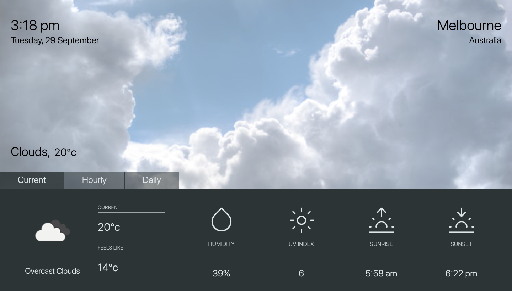
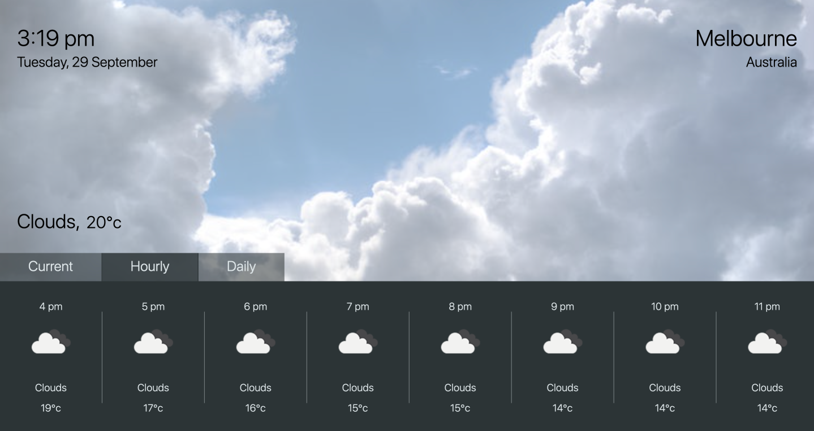
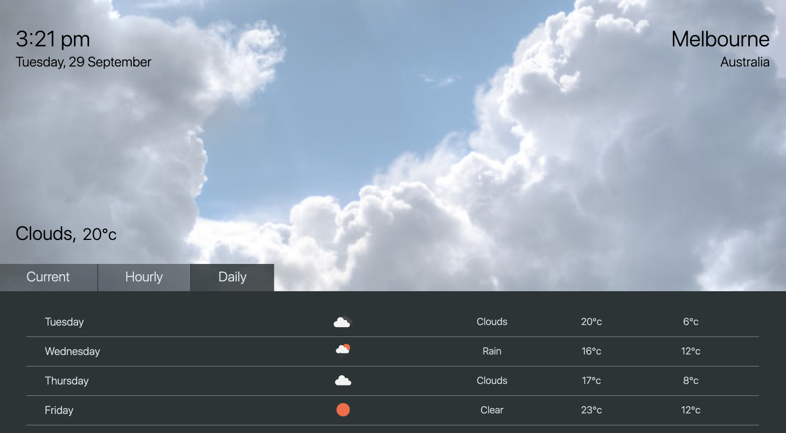

## is it sunny ☀️

### A simple weather web-app to practice...

- React
- Styled Components

[github-pages](https://minapark127.github.io/is_it_sunny/#/)

### Sample pages

| Home                                                   |
| :----------------------------------------------------- |
|  |

| Hourly                                                    |
| :-------------------------------------------------------- |
|  |

| Daily                                                  |
| :----------------------------------------------------- |
|  |
